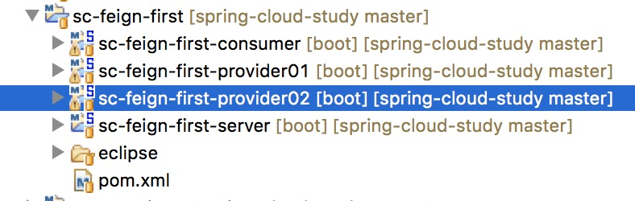
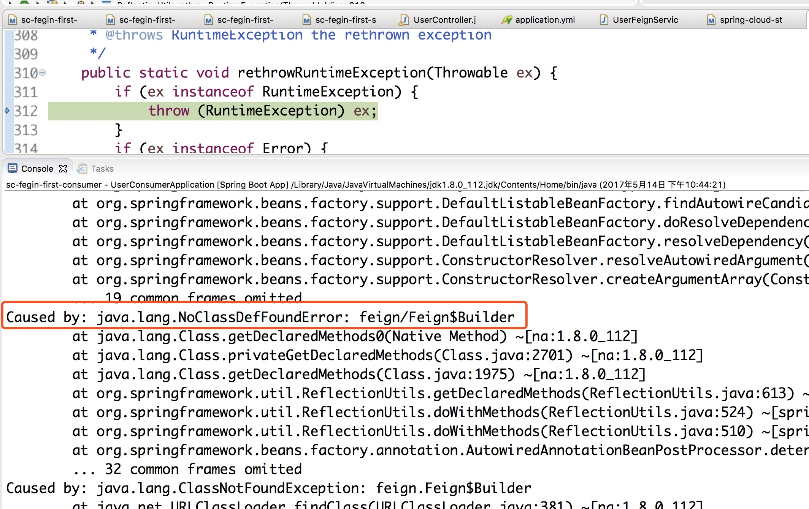
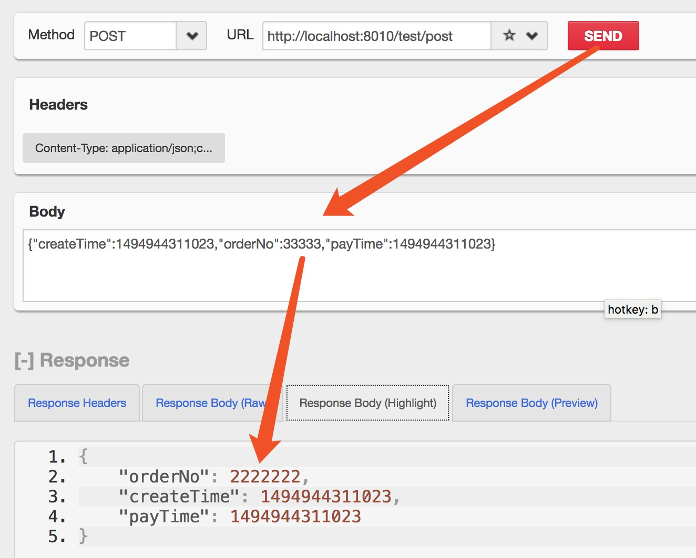

[TOC]


# 快速使用Spring Cloud Feign作为客户端调用服务提供者

**前言** 在使用Spring Cloud开发微服务应用时中，各个微服务服务提供者都是以HTTP接口的形式对外提供服务，因此服务消费者在调用服务提供者时，通过HTTP Client的方式访问。当然我们可以使用JDK原生的`URLConnection`、`Apache的Http Client`、`Netty的异步HTTP Client`, Spring的`RestTemplate`去实现服务间的调用。Spring Cloud对Feign进行了增强，使Feign支持了Spring MVC的注解，并整合了Ribbon和Eureka，从而让Feign的使用更加方便。

## Feign简介

Feign是一种声明式、模板化的HTTP客户端。在**Spring Cloud**中使用Feign, 可以做到使用HTTP**请求远程服务**时能就像调用本地方法一样的体验，开发者完全感知不到这是远程方法，更感知不到这是个HTTP请求。[Feign的Github网址](https://github.com/openfeign/feign),比如：
Feign具有如下特性：

- 可插拔的注解支持，包括Feign注解和JAX-RS注解

- 支持可插拔的HTTP编码器和解码器

- 支持Hystrix和它的Fallback

- 支持Ribbon的负载均衡

- 支持HTTP请求和响应的压缩

   

  Feign是一个声明式的

  Web Service

  客户端，它的目的就是让

  Web Service

  调用更加简单。它整合了

  ```
  Ribbon
  ```

  和

  ```
  Hystrix
  ```

  ，从而不再需要显式地使用这两个组件。Feign还提供了HTTP请求的模板，通过编写简单的接口和注解，就可以定义好HTTP请求的参数、格式、地址等信息。接下来，Feign会完全代理HTTP的请求，我们只需要像调用方法一样调用它就可以完成服务请求。

  ## Feign 示例工程

[](http://xujin.org/images/sc-study/sc-feign-ml.png)工程目录
链接：<https://github.com/SoftwareKing/spring-cloud-study/tree/master/sc-feign-first>

> 本文最终修改时间：2017-05-20 18:47:23，为了解决`问题1和2`最终使用版本:Spring Boot的版本为`1.5.3.RELEASE`，Spring Cloud版本为`Dalston.RELEASE`

### 服务消费者中sc-feign-first-consumer的Feign的定义

为了让Feign知道在调用方法时应该向哪个地址发请求以及请求需要带哪些参数，我们需要定义一个接口：

```
package org.xujin.sc.feign.user.service;

import org.springframework.cloud.netflix.feign.FeignClient;
import org.springframework.web.bind.annotation.PathVariable;
import org.springframework.web.bind.annotation.RequestMapping;
import org.springframework.web.bind.annotation.RequestMethod;
import org.xujin.sc.feign.user.model.OrderModel;

@FeignClient(name = "sc-feign-first-provider")//【A】
public interface UserFeignService {

@RequestMapping(value = "/sc/order/{id}", method = RequestMethod.GET)//【B】
public OrderModel findOrderById(@PathVariable("id") Long id); //【C】

}
```

> A: @FeignClient用于通知Feign组件对该接口进行代理(不需要编写接口实现)，使用者可直接通过@Autowired注入，如下代码所示。

```
 // 注入服务提供者,远程的Http服务
@Autowired
private UserFeignService userFeignService;
```

> B: @RequestMapping表示在调用该方法时需要向/sc/order/{id}发送GET请求。
>
> C: @PathVariable与SpringMVC中对应注解含义相同

### 服务消费者中Feign的使用

```
package org.xujin.sc.feign.user.controller;
import org.slf4j.Logger;
import org.slf4j.LoggerFactory;
import org.springframework.beans.factory.annotation.Autowired;
import org.springframework.web.bind.annotation.GetMapping;
import org.springframework.web.bind.annotation.PathVariable;
import org.springframework.web.bind.annotation.RestController;
import org.xujin.sc.feign.user.model.OrderModel;
import org.xujin.sc.feign.user.service.UserFeignService;

/**
 * UserController
 * @author xujin
 */
@RestController
public class UserController {

	private static final Logger logger = LoggerFactory.getLogger(UserController.class);

	// 注入服务提供者,远程的Http服务
	@Autowired
	private UserFeignService userFeignService;

	// 服务消费者对位提供的服务
	@GetMapping("/sc/user/{id}")
	public OrderModel findByIdByEurekaServer(@PathVariable Long id) {
		return userFeignService.findOrderById(id);

	}
}
```

> 如上代码所示，通过@Autowired将声明的Feign依赖注入即可，调用userFeignService.findOrderById(id)使用。开发者通过userFeignService.findOrderById()就能完成发送HTTP请求和解码HTTP返回结果并封装成对象的过程。

### 启动测试

依次按顺序启动如下工程
注册中心: sc-Feign-first-server
服务提供者1:sc-Feign-first-provider01
服务提供者2:sc-Feign-first-provider02
以上工程能正常启动work，但是当启动服务消费者: sc-Feign-first-consumer报错如下。

> 使用的示例工程的Spring Boot的版本为1.5.2.RELEASE，Spring Cloud版本为Dalston.RELEASE会出现以下错误。

```
<!-- 引入spring boot的依赖 -->
	<parent>
		<groupId>org.springframework.boot</groupId>
		<artifactId>spring-boot-starter-parent</artifactId>
		<version>1.5.2.RELEASE</version>
	</parent>
	
<!-- 引入spring cloud的依赖 -->
  <dependencyManagement>
    <dependencies>
        <dependency>
            <groupId>org.springframework.cloud</groupId>
            <artifactId>spring-cloud-dependencies</artifactId>
            <version>Dalston.RELEASE</version>
            <type>pom</type>
            <scope>import</scope>
        </dependency>
    </dependencies>
</dependencyManagement>
```

访问<http://localhost:8010/sc/user/1> ,出现以下错误即：
`【问题一】`feign/Feign$Builder
Caused by: java.lang.NoClassDefFoundError: feign/Feign$Builder

```
java.lang.IllegalStateException: ApplicationEventMulticaster not initialized - call 'refresh' before multicasting events via the context: org.springframework.boot.context.embedded.AnnotationConfigEmbeddedWebApplicationContext@2d140a7: startup date [Sun May 14 22:44:43 CST 2017]; parent: org.springframework.context.annotation.AnnotationConfigApplicationContext@4bf48f6
	at org.springframework.context.support.AbstractApplicationContext.getApplicationEventMulticaster(AbstractApplicationContext.java:404) [spring-context-4.3.7.RELEASE.jar:4.3.7.RELEASE]
	at org.springframework.context.support.ApplicationListenerDetector.postProcessBeforeDestruction(ApplicationListenerDetector.java:97) ~[spring-context-4.3.7.RELEASE.jar:4.3.7.RELEASE]
	at org.springframework.beans.factory.support.DisposableBeanAdapter.destroy(DisposableBeanAdapter.java:253) ~[spring-beans-4.3.7.RELEASE.jar:4.3.7.RELEASE]
	at org.springframework.beans.factory.support.DefaultSingletonBeanRegistry.destroyBean(DefaultSingletonBeanRegistry.java:578) [spring-beans-4.3.7.RELEASE.jar:4.3.7.RELEASE]
	at org.springframework.beans.factory.support.DefaultSingletonBeanRegistry.destroySingleton(DefaultSingletonBeanRegistry.java:554) [spring-beans-4.3.7.RELEASE.jar:4.3.7.RELEASE]
	at org.springframework.beans.factory.support.DefaultListableBeanFactory.destroySingleton(DefaultListableBeanFactory.java:961) [spring-beans-4.3.7.RELEASE.jar:4.3.7.RELEASE]
	at org.springframework.beans.factory.support.DefaultSingletonBeanRegistry.destroySingletons(DefaultSingletonBeanRegistry.java:523) [spring-beans-4.3.7.RELEASE.jar:4.3.7.RELEASE]
	at org.springframework.beans.factory.support.DefaultListableBeanFactory.destroySingletons(DefaultListableBeanFactory.java:968) [spring-beans-4.3.7.RELEASE.jar:4.3.7.RELEASE]
	at org.springframework.context.support.AbstractApplicationContext.destroyBeans(AbstractApplicationContext.java:1033) [spring-context-4.3.7.RELEASE.jar:4.3.7.RELEASE]
	at org.springframework.context.support.AbstractApplicationContext.refresh(AbstractApplicationContext.java:555) [spring-context-4.3.7.RELEASE.jar:4.3.7.RELEASE]
	at org.springframework.boot.context.embedded.EmbeddedWebApplicationContext.refresh(EmbeddedWebApplicationContext.java:122) [spring-boot-1.5.2.RELEASE.jar:1.5.2.RELEASE]
	at org.springframework.boot.SpringApplication.refresh(SpringApplication.java:737) [spring-boot-1.5.2.RELEASE.jar:1.5.2.RELEASE]
	at org.springframework.boot.SpringApplication.refreshContext(SpringApplication.java:370) [spring-boot-1.5.2.RELEASE.jar:1.5.2.RELEASE]
	at org.springframework.boot.SpringApplication.run(SpringApplication.java:314) [spring-boot-1.5.2.RELEASE.jar:1.5.2.RELEASE]
	at org.springframework.boot.SpringApplication.run(SpringApplication.java:1162) [spring-boot-1.5.2.RELEASE.jar:1.5.2.RELEASE]
	at org.springframework.boot.SpringApplication.run(SpringApplication.java:1151) [spring-boot-1.5.2.RELEASE.jar:1.5.2.RELEASE]
	at org.xujin.sc.feign.user.UserConsumerApplication.main(UserConsumerApplication.java:15) [classes/:na]

2017-05-14 22:44:44.079 ERROR 2372 --- [           main] o.s.boot.SpringApplication               : Application startup failed

org.springframework.beans.factory.UnsatisfiedDependencyException: Error creating bean with name 'methodValidationPostProcessor' defined in class path resource [org/springframework/boot/autoconfigure/validation/ValidationAutoConfiguration.class]: Unsatisfied dependency expressed through method 'methodValidationPostProcessor' parameter 0; nested exception is org.springframework.beans.factory.BeanCreationException: Error creating bean with name 'org.xujin.sc.feign.user.service.UserFeignService': Failed to introspect bean class [org.springframework.cloud.netflix.feign.FeignClientFactoryBean] for lookup method metadata: could not find class that it depends on; nested exception is java.lang.NoClassDefFoundError: feign/Feign$Builder
	at org.springframework.beans.factory.support.ConstructorResolver.createArgumentArray(ConstructorResolver.java:749) ~[spring-beans-4.3.7.RELEASE.jar:4.3.7.RELEASE]
	at org.springframework.beans.factory.support.ConstructorResolver.instantiateUsingFactoryMethod(ConstructorResolver.java:467) ~[spring-beans-4.3.7.RELEASE.jar:4.3.7.RELEASE]
	at org.springframework.beans.factory.support.AbstractAutowireCapableBeanFactory.instantiateUsingFactoryMethod(AbstractAutowireCapableBeanFactory.java:1173) ~[spring-beans-4.3.7.RELEASE.jar:4.3.7.RELEASE]
	at org.springframework.beans.factory.support.AbstractAutowireCapableBeanFactory.createBeanInstance(AbstractAutowireCapableBeanFactory.java:1067) ~[spring-beans-4.3.7.RELEASE.jar:4.3.7.RELEASE]
	at org.springframework.beans.factory.support.AbstractAutowireCapableBeanFactory.doCreateBean(AbstractAutowireCapableBeanFactory.java:513) ~[spring-beans-4.3.7.RELEASE.jar:4.3.7.RELEASE]
	at org.springframework.beans.factory.support.AbstractAutowireCapableBeanFactory.createBean(AbstractAutowireCapableBeanFactory.java:483) ~[spring-beans-4.3.7.RELEASE.jar:4.3.7.RELEASE]
	at org.springframework.beans.factory.support.AbstractBeanFactory$1.getObject(AbstractBeanFactory.java:306) ~[spring-beans-4.3.7.RELEASE.jar:4.3.7.RELEASE]
	at org.springframework.beans.factory.support.DefaultSingletonBeanRegistry.getSingleton(DefaultSingletonBeanRegistry.java:230) ~[spring-beans-4.3.7.RELEASE.jar:4.3.7.RELEASE]
	at org.springframework.beans.factory.support.AbstractBeanFactory.doGetBean(AbstractBeanFactory.java:302) ~[spring-beans-4.3.7.RELEASE.jar:4.3.7.RELEASE]
	at org.springframework.beans.factory.support.AbstractBeanFactory.getBean(AbstractBeanFactory.java:202) ~[spring-beans-4.3.7.RELEASE.jar:4.3.7.RELEASE]
	at org.springframework.context.support.PostProcessorRegistrationDelegate.registerBeanPostProcessors(PostProcessorRegistrationDelegate.java:223) ~[spring-context-4.3.7.RELEASE.jar:4.3.7.RELEASE]
	at org.springframework.context.support.AbstractApplicationContext.registerBeanPostProcessors(AbstractApplicationContext.java:702) ~[spring-context-4.3.7.RELEASE.jar:4.3.7.RELEASE]
	at org.springframework.context.support.AbstractApplicationContext.refresh(AbstractApplicationContext.java:527) ~[spring-context-4.3.7.RELEASE.jar:4.3.7.RELEASE]
	at org.springframework.boot.context.embedded.EmbeddedWebApplicationContext.refresh(EmbeddedWebApplicationContext.java:122) ~[spring-boot-1.5.2.RELEASE.jar:1.5.2.RELEASE]
	at org.springframework.boot.SpringApplication.refresh(SpringApplication.java:737) [spring-boot-1.5.2.RELEASE.jar:1.5.2.RELEASE]
	at org.springframework.boot.SpringApplication.refreshContext(SpringApplication.java:370) [spring-boot-1.5.2.RELEASE.jar:1.5.2.RELEASE]
	at org.springframework.boot.SpringApplication.run(SpringApplication.java:314) [spring-boot-1.5.2.RELEASE.jar:1.5.2.RELEASE]
	at org.springframework.boot.SpringApplication.run(SpringApplication.java:1162) [spring-boot-1.5.2.RELEASE.jar:1.5.2.RELEASE]
	at org.springframework.boot.SpringApplication.run(SpringApplication.java:1151) [spring-boot-1.5.2.RELEASE.jar:1.5.2.RELEASE]
	at org.xujin.sc.feign.user.UserConsumerApplication.main(UserConsumerApplication.java:15) [classes/:na]
Caused by: org.springframework.beans.factory.BeanCreationException: Error creating bean with name 'org.xujin.sc.feign.user.service.UserFeignService': Failed to introspect bean class [org.springframework.cloud.netflix.feign.FeignClientFactoryBean] for lookup method metadata: could not find class that it depends on; nested exception is java.lang.NoClassDefFoundError: feign/Feign$Builder
	at org.springframework.beans.factory.annotation.AutowiredAnnotationBeanPostProcessor.determineCandidateConstructors(AutowiredAnnotationBeanPostProcessor.java:269) ~[spring-beans-4.3.7.RELEASE.jar:4.3.7.RELEASE]
	at org.springframework.beans.factory.support.AbstractAutowireCapableBeanFactory.determineConstructorsFromBeanPostProcessors(AbstractAutowireCapableBeanFactory.java:1118) ~[spring-beans-4.3.7.RELEASE.jar:4.3.7.RELEASE]
	at org.springframework.beans.factory.support.AbstractAutowireCapableBeanFactory.createBeanInstance(AbstractAutowireCapableBeanFactory.java:1091) ~[spring-beans-4.3.7.RELEASE.jar:4.3.7.RELEASE]
	at org.springframework.beans.factory.support.AbstractAutowireCapableBeanFactory.getSingletonFactoryBeanForTypeCheck(AbstractAutowireCapableBeanFactory.java:923) ~[spring-beans-4.3.7.RELEASE.jar:4.3.7.RELEASE]
	at org.springframework.beans.factory.support.AbstractAutowireCapableBeanFactory.getTypeForFactoryBean(AbstractAutowireCapableBeanFactory.java:804) ~[spring-beans-4.3.7.RELEASE.jar:4.3.7.RELEASE]
	at org.springframework.beans.factory.support.AbstractBeanFactory.isTypeMatch(AbstractBeanFactory.java:558) ~[spring-beans-4.3.7.RELEASE.jar:4.3.7.RELEASE]
	at org.springframework.beans.factory.support.DefaultListableBeanFactory.doGetBeanNamesForType(DefaultListableBeanFactory.java:432) ~[spring-beans-4.3.7.RELEASE.jar:4.3.7.RELEASE]
	at org.springframework.beans.factory.support.DefaultListableBeanFactory.getBeanNamesForType(DefaultListableBeanFactory.java:395) ~[spring-beans-4.3.7.RELEASE.jar:4.3.7.RELEASE]
	at org.springframework.beans.factory.BeanFactoryUtils.beanNamesForTypeIncludingAncestors(BeanFactoryUtils.java:220) ~[spring-beans-4.3.7.RELEASE.jar:4.3.7.RELEASE]
	at org.springframework.beans.factory.support.DefaultListableBeanFactory.findAutowireCandidates(DefaultListableBeanFactory.java:1260) ~[spring-beans-4.3.7.RELEASE.jar:4.3.7.RELEASE]
	at org.springframework.beans.factory.support.DefaultListableBeanFactory.doResolveDependency(DefaultListableBeanFactory.java:1101) ~[spring-beans-4.3.7.RELEASE.jar:4.3.7.RELEASE]
	at org.springframework.beans.factory.support.DefaultListableBeanFactory.resolveDependency(DefaultListableBeanFactory.java:1066) ~[spring-beans-4.3.7.RELEASE.jar:4.3.7.RELEASE]
	at org.springframework.beans.factory.support.ConstructorResolver.resolveAutowiredArgument(ConstructorResolver.java:835) ~[spring-beans-4.3.7.RELEASE.jar:4.3.7.RELEASE]
	at org.springframework.beans.factory.support.ConstructorResolver.createArgumentArray(ConstructorResolver.java:741) ~[spring-beans-4.3.7.RELEASE.jar:4.3.7.RELEASE]
	... 19 common frames omitted
Caused by: java.lang.NoClassDefFoundError: feign/Feign$Builder
	at java.lang.Class.getDeclaredMethods0(Native Method) ~[na:1.8.0_112]
	at java.lang.Class.privateGetDeclaredMethods(Class.java:2701) ~[na:1.8.0_112]
	at java.lang.Class.getDeclaredMethods(Class.java:1975) ~[na:1.8.0_112]
	at org.springframework.util.ReflectionUtils.getDeclaredMethods(ReflectionUtils.java:613) ~[spring-core-4.3.7.RELEASE.jar:4.3.7.RELEASE]
	at org.springframework.util.ReflectionUtils.doWithMethods(ReflectionUtils.java:524) ~[spring-core-4.3.7.RELEASE.jar:4.3.7.RELEASE]
	at org.springframework.util.ReflectionUtils.doWithMethods(ReflectionUtils.java:510) ~[spring-core-4.3.7.RELEASE.jar:4.3.7.RELEASE]
	at org.springframework.beans.factory.annotation.AutowiredAnnotationBeanPostProcessor.determineCandidateConstructors(AutowiredAnnotationBeanPostProcessor.java:247) ~[spring-beans-4.3.7.RELEASE.jar:4.3.7.RELEASE]
	... 32 common frames omitted
Caused by: java.lang.ClassNotFoundException: feign.Feign$Builder
	at java.net.URLClassLoader.findClass(URLClassLoader.java:381) ~[na:1.8.0_112]
	at java.lang.ClassLoader.loadClass(ClassLoader.java:424) ~[na:1.8.0_112]
	at sun.misc.Launcher$AppClassLoader.loadClass(Launcher.java:331) ~[na:1.8.0_112]
	at java.lang.ClassLoader.loadClass(ClassLoader.java:357) ~[na:1.8.0_112]
	... 39 common frames omitted
```

[](http://xujin.org/images/sc-study/sc-feign1.png)sc-feign1

------

经查找解决问题2天查看无果(捂脸，后面写源码分析定位)，因此决定将Spring Boot的版本改变为1.4.3.RELEASE，Spring Cloud版本为Camden.SR5之后,按上面的顺序启动，之后测试<http://localhost:8010/sc/user/1> ,可以正常work。

## Feign的work原理

Spring Cloud应用在启动时，Feign会`扫描标有@FeignClient`注解的接口，`生成代理`，并注册到`Spring容器中`。生成代理时Feign会为`每个接口方法创建一个RequetTemplate对象`，该对象`封装了HTTP请求`需要的全部信息，请求参数名、请求方法等信息都是在这个过程中确定的，Feign的模板化就体现在这里。
在本例中，我们将Feign与Eureka和Ribbon组合使用，@FeignClient(name = “sc-feign-first-provider”)意为通知Feign在调用该接口方法时要向Eureka中查询名为ea的服务，从而得到服务URL。

## Feign的常见应用

### Feign的Encoder、Decoder和ErrorDecoder

Feign将方法签名中方法参数对象序列化为请求参数放到HTTP请求中的过程，是由编码器(Encoder)完成的。同理，将HTTP响应数据反序列化为java对象是由解码器(Decoder)完成的。

默认情况下，Feign会将标有@RequestParam注解的参数转换成字符串添加到URL中，将没有注解的参数通过Jackson转换成json放到请求体中。

> 注意，如果在@RequetMapping中的method将请求方式指定为GET，那么所有未标注解的参数将会被忽略，例如：

```
@RequestMapping(value = "/group/{groupId}", method = RequestMethod.GET)
void update(@PathVariable("groupId") Integer groupId, @RequestParam("groupName") String groupName, DataObject obj);
```

此时因为声明的是GET请求没有请求体，所以obj参数就会被忽略。

- 在Spring Cloud环境下，Feign的Encoder只会用来编码没有添加注解的参数。如果你自定义了Encoder, 那么只有在编码obj参数时才会调用你的Encoder。
- 对于Decoder, 默认会委托给SpringMVC中的MappingJackson2HttpMessageConverter类进行解码。只有当状态码不在200 ~ 300之间时ErrorDecoder才会被调用。
- ErrorDecoder的作用是可以根据HTTP响应信息返回一个异常，该异常可以在调用Feign接口的地方被捕获到。
  我们目前就通过ErrorDecoder来使Feign接口抛出业务异常以供调用者处理。

### 更换Feign默认使用的HTTP Client

Feign在默认情况下使用的是JDK原生的`URLConnection`发送HTTP请求，没有连接池，但是对每个地址会保持一个长连接，即利用HTTP的persistence connection 。我们可以用Apache的`HTTP Client`替换Feign原始的http client, 从而获取`连接池、超时时间`等与性能息息相关的控制能力。Spring Cloud从Brixtion.SR5版本开始支持这种替换，首先在项目中声明Apache HTTP Client和feign-httpclient依赖：

```xml
<!-- 使用Apache HttpClient替换Feign原生httpclient -->
<dependency>
    <groupId>org.apache.httpcomponents</groupId>
    <artifactId>httpclient</artifactId>
</dependency>
<dependency>
    <groupId>com.netflix.feign</groupId>
    <artifactId>feign-httpclient</artifactId>
    <version>8.17.0</version>
</dependency>
```

然后在`application.yml`中添加如下：

```
feign:
  httpclient:
    enabled: true
```

[spring cloud feign使用okhttp3参考](https://segmentfault.com/a/1190000009071952)

## spring cloud feign常见问题

### 参数不会自动传递

服务消费者端调用

```
@RequestMapping(value = "/test", method = RequestMethod.GET)
	public String hello(@RequestParam("name") String name, @RequestParam("age") int age) {
		return userFeignService.hello(name, age);
	}
```

服务提供者Controller对外服务

```
@RequestMapping(value = "/hello", method = RequestMethod.GET)
	public String hello(@RequestParam("name") String name, @RequestParam("age") int age) {
		return name + age;
	}
```

Feign客户端定义调用

```
@RequestMapping(value = "/hello", method = RequestMethod.GET)
	public String hello(String name, @RequestParam("age") int age);
```

启动的时候sc-Feign-first-consumer工程不报错。但是当访问<http://localhost:8010/test?name=xujin&age=25> ,报错如下

```
feign.FeignException: status 405 reading UserFeignService#hello(String,int); content:
{"timestamp":1494856464666,"status":405,"error":"Method Not Allowed","exception":"org.springframework.web.HttpRequestMethodNotSupportedException","message":"Request method 'POST' not supported","path":"/hello"}
	at feign.FeignException.errorStatus(FeignException.java:62) ~[feign-core-9.3.1.jar:na]
```

Feign客户端定义修改如下OK，原因是name被自动放到request body。只要有body，就会被feign认为是post请求，所以整个hello是被当作带有request parameter和body的post请求发送出去了，因此出现上面的错误提示。

```
@RequestMapping(value = "/hello", method = RequestMethod.GET)
	public String hello(@RequestParam("name") String name, @RequestParam("age") int age);
```

### POST多参数调用

- POST多参数 Feign端定义：

```
@RequestMapping(value = "/test/post", method = RequestMethod.POST)
public OrderModel post(OrderModel orderModel);
```

```
@RequestMapping(value = "/test/post", method = RequestMethod.POST)
public OrderModel post(@RequestBody OrderModel orderModel);
```

> 以上两种定义方式等价

- 服务提供者的定义

```
@PostMapping("/test/post")
public OrderModel testPost(@RequestBody OrderModel orderModel) {
	orderModel.setOrderNo(2222222L);
	return orderModel;
}
```

> 修改订单号返回证明，服务提供者接到从Feign POST请求过来的数据。

- 服务消费者端的使用

```
@PostMapping("/test/post")
public OrderModel testPost(@RequestBody OrderModel orderModel) {
	return userFeignService.post(orderModel);
}
```

- 测试

  当修改了Feign默认的http Client之后，出现如下错误，具体出错原因还在排查之中，本文会随时更改。

  ```
  【问题二】
  ```

  更换了Feign默认的Client出现HystrixRuntimeException

  ```
  {
      "timestamp": 1494947172990,
      "status": 500,
      "error": "Internal Server Error",
      "exception": "com.netflix.hystrix.exception.HystrixRuntimeException",
      "message": "UserFeignService#post(OrderModel) failed and no fallback available.",
      "path": "/test/post"
  }
  ```

```
java.lang.IllegalArgumentException: MIME type may not contain reserved characters
	at org.apache.http.util.Args.check(Args.java:36) ~[httpcore-4.4.5.jar:4.4.5]
	at org.apache.http.entity.ContentType.create(ContentType.java:182) ~[httpcore-4.4.5.jar:4.4.5]
	at feign.httpclient.ApacheHttpClient.getContentType(ApacheHttpClient.java:159) ~[feign-httpclient-8.17.0.jar:8.17.0]
	at feign.httpclient.ApacheHttpClient.toHttpUriRequest(ApacheHttpClient.java:140) ~[feign-httpclient-8.17.0.jar:8.17.0]
	at feign.httpclient.ApacheHttpClient.execute(ApacheHttpClient.java:83) ~[feign-httpclient-8.17.0.jar:8.17.0]
```

当关闭之后，访问正常如下所示，醉了同样的代码(PS:捂脸)

```
feign:
  httpclient:
    enabled: false
```

```
{"createTime":1494944311023,"orderNo":33333,"payTime":1494944311023}
```

[](http://xujin.org/images/sc-study/sc-feign-post.png)sc-feign-post.png

### GET多参数调用

当服务之间GET调用为多参数时，可以使用Map来构建参数传递
Feign接口中的示例定义

```
@RequestMapping(value = "/test/get", method = RequestMethod.GET)
public String testGet(@RequestParam Map<String, Object> map);
```

服务消费者的调用

```
@GetMapping("/test/get")
public String testGet() {
	HashMap<String, Object> map = Maps.newHashMap();
	map.put("orderNo", "1");
	map.put("createTime", new Date());
	map.put("payTime", new Date());
	return userFeignService.testGet(map);
}
```

> 个人看来，如果是GET的多参数通过Map进行传递，当参数比较多时，个人建议使用面向对象的思维，通过POST的方式传递对象相对较好。

服务提供者的使用

```
@RequestMapping(value = "/test/get", method = RequestMethod.GET)
public String testGet(@RequestParam Map<String, Object> map) {
	return String.valueOf(map);
}
```

访问URL:<http://localhost:8010/test/get> ,测试OK.

```
{orderNo=1, createTime=Sat May 20 19:47:38 CST 2017, payTime=Sat May 20 19:47:38 CST 2017}
```

## 总结

本文主要介绍了Feign的基本的定义，以及Feign的work原理和使用Feign的注意事项和常见问题。最后介绍了一下更换Feign默认使用的HTTP Client。主要是遇到一个奇葩的问题，最终没解决更换版本。在下一篇文章中将介绍Feign的其它的使用，例如Feign的继承，日志级别，以及Feign源码分析等

## 参考文献

[希望Feign能够支持参数请求使用POJO的Issue](https://github.com/spring-cloud/spring-cloud-netflix/issues/1253)
[建议使用Feign原生的注解的Issue](https://github.com/spring-cloud/spring-cloud-netflix/issues/659)
[建议增强Feign的功能](https://github.com/spring-cloud/spring-cloud-netflix/issues/1360)
[建议支持可选的Request Body（目前Feign当POST一个null时，会报异常）](https://github.com/spring-cloud/spring-cloud-netflix/issues/1047)

 本文由**许进**创作和发表,采用[CC BY 3.0 CN协议](http://creativecommons.org/licenses/by/3.0/cn) 进行许可。转载请注明作者及出处,本文作者为**许进**,本文标题为**快速使用Spring Cloud Feign作为客户端调用服务提供者** 本文链接为**http://xujin.org/sc/sc-Feign01/**


http://xujin.org/sc/sc-fegin01/#Feign简介

