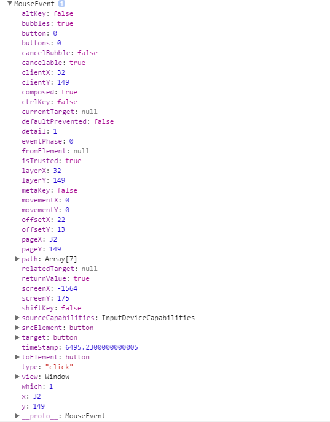

[TOC]


# Vue2.0教程第三季 选项

 前言：Vue2.0视频教程已经出了两季，这些都是基础，为的就是能让新手快速进入。这一季讲的是基础中的选项，选项就是在Vue构造器里的配置功能的前缀（Vue已经给我们定义好了），Vue有很多选项，我们将在这一级教程中一一介绍。

## 第1节：propsData Option  全局扩展的数据传递

propsData 不是和属性有关，他用在全局扩展时进行传递数据。先回顾一下全局扩展的知识，作一个<header></header>的扩展标签出来。实际我们并比推荐用全局扩展的方式作自定义标签，我们学了组件，完全可以使用组件来做，这里只是为了演示propsData的用法。

代码如下：

```
<!DOCTYPE html>
<html lang="en">
<head>
    <meta charset="UTF-8">
    <script type="text/javascript" src="../assets/js/vue.js"></script>
    <title>PropsData Option Demo</title>
</head>
<body>
    <h1>PropsData Option Demo</h1>
    <hr>
    <header></header>
 
    <script type="text/javascript">
       var  header_a = Vue.extend({
           template:`<p>{{message}}</p>`,
           data:function(){
               return {
                   message:'Hello,I am Header'
               }
           }
       }); 
       new header_a().$mount('header');
    </script>
</body>
</html>
```

扩展标签已经做好了，这时我们要在挂载时传递一个数字过去，我们就用到了propsData。

我们用propsData三步解决传值：

1、在全局扩展里加入props进行接收。propsData:{a:1}

2、传递时用propsData进行传递。props:[‘a’]

3、用插值的形式写入模板。{{ a }}

完整代码：

```
var  header_a = Vue.extend({
    template:`<p>{{message}}-{{a}}</p>`,
    data:function(){
        return {
            message:'Hello,I am Header'
        }
    },
    props:['a']
}); 
new header_a({propsData:{a:1}}).$mount('header');
```

总结：propsData在实际开发中我们使用的并不多，我们在后边会学到Vuex的应用，他的作用就是在单页应用中保持状态和数据的。

## 第2节：computed Option  计算选项

computed 的作用主要是对原数据进行改造输出。改造输出：包括格式的编辑，大小写转换，顺序重排，添加符号……。

**一、格式化输出结果：**

我们先来做个读出价格的例子：我们读书的原始数据是price:100    但是我们输出给用户的样子是（￥100元）。

主要的javascript代码：

```js
computed:{
    newPrice:function(){
        return this.price='￥' + this.price + '元';
    }
}
```

全部代码：

```html
<!DOCTYPE html>
<html lang="en">
<head>
    <meta charset="UTF-8">
    <script type="text/javascript" src="../assets/js/vue.js"></script>
    <title>Computed Option 计算选项</title>
</head>
<body>
    <h1>Computed Option 计算选项</h1>
    <hr>
    <div id="app">
        {{newPrice}}
    </div>
 
    <script type="text/javascript">
        var app=new Vue({
            el:'#app',
            data:{
                price:100
            },
            computed:{
                newPrice:function(){
                    return this.price='￥' + this.price + '元';
                }
            }
        })
    </script>
</body>
</html>
```

现在输出的结果就是：￥100元。

**二、用计算属性反转数组**

例如：我们得到了一个新闻列表的数组，它的顺序是安装新闻时间的顺序正序排列的，也就是早反生的新闻排在前面。这是反人类的，我们需要给他反转。这时我们就可以用到我们的计算属性了。

没有排序的新闻列表，是安装日期正序排列的。

```
var newsList=[
    {title:'香港或就“装甲车被扣”事件追责 起诉涉事运输公司',date:'2017/3/10'},
    {title:'日本第二大准航母服役 外媒：针对中国潜艇',date:'2017/3/12'},
    {title:'中国北方将有明显雨雪降温天气 南方阴雨持续',date:'2017/3/13'},
    {title:'起底“最短命副市长”：不到40天落马，全家被查',date:'2017/3/23'},
];
```

我们希望输出的结果：

> - 起底“最短命副市长”：不到40天落马，全家被查-2017/3/23
> - 中国北方将有明显雨雪降温天气 南方阴雨持续-2017/3/13
> - 日本第二大准航母服役 外媒：针对中国潜艇-2017/3/12
> - 香港或就“装甲车被扣”事件追责 起诉涉事运输公司-2017/3/10

我们的在computed里的javascript代码：我们用js原生方法给数组作了反转。

```
computed:{
    reverseNews:function(){
        return this.newsList.reverse();
    }
}
```

总结：computed 属性是非常有用，在输出数据前可以轻松的改变数据。所以说这节课的代码必须要多敲几遍，加深印象。

## 第3节：Methods Option  方法选项

在以前的学习中，已经大量的使用了构造器里的methods选项，但是并没有仔细和系统的讲解过，这节课我们用点时间把methods这个选项涉及的东西都讲一讲。

我们还是复习一下最简单的使用方法，一个数字，每点击一下按钮加1.（做过很多次了，你们可以先不看代码和视频自己试着写一下）

```
<!DOCTYPE html>
<html lang="en">
<head>
    <meta charset="UTF-8">
    <script type="text/javascript" src="../assets/js/vue.js"></script>
    <title>methods Option</title>
</head>
<body>
    <h1>methods Option</h1>
    <hr>
    <div id="app">
        {{ a }}
        <p><button @click="add">add</button></p>
    </div>
 
    <script type="text/javascript">
        var app=new Vue({
            el:'#app',
            data:{
                a:1
            },
            methods:{
                add:function(){
                    this.a++
                }
            }
        })
    </script>
</body>
</html>
```


### 一、methods中参数的传递

使用方法和正常的javascript传递参数的方法一样，分为两部：

1、在methods的方法中进行声明，比如我们给add方法加上一个num参数，就要写出add:function(num){}.

2、调用方法时直接传递，比如我们要传递2这个参数，我们在button上就直接可以写。<button @click=”add(2)”></button>.

现在知道了加参数的方法，看一段完整的代码，代码中给add添加了num参数，并在按钮上调用传递了。

```
<!DOCTYPE html>
<html lang="en">
<head>
    <meta charset="UTF-8">
    <script type="text/javascript" src="../assets/js/vue.js"></script>
    <title>methods Option</title>
</head>
<body>
    <h1>methods Option</h1>
    <hr>
    <div id="app">
        {{ a }}
        <p><button @click="add(2)">add</button></p>
    </div>
 
    <script type="text/javascript">
        var app=new Vue({
            el:'#app',
            data:{
                a:1
            },
            methods:{
                add:function(num){
                    if(num!=''){this.a+=num}
                    else{this.a++}
                }
            }
        })
    </script>
</body>
</html>
```

这时，再点击按钮是每次加2个数字。

### 二、methods中的$event参数

传递的$event参数都是关于你点击鼠标的一些事件和属性。我们先看看传递的方法。

传递：<button @click=”add(2,$event)”>add</button> 。

我们这时候可以打印一下，看看event到底是个怎样的对象。你会发现，它包含了大部分鼠标事件的属性。



### 三、native  给组件绑定构造器里的原生事件。

在实际开发中经常需要把某个按钮封装成组件，然后反复使用，如何让组件调用构造器里的方法，而不是组件里的方法。就需要用到我们的.native修饰器了。

现在我们把我们的add按钮封装成组件：

声明btn对象：

```
var btn={
    template:`<button>组件Add</button>`     
}
```

在构造器里声明：

```
 components:{
    "btn":btn
 }
```

用.native修饰器来调用构造器里的add方法

```
<p><btn @click.native="add(3)"></btn></p>
```

 

### 四、作用域外部调用构造器里的方法

这种不经常使用，如果你出现了这种情况，说明你的代码组织不够好。

```
<button onclick="app.add(4)" >外部调用构造器里的方法</button>
```

 

 

http://jspang.com/2017/03/26/vue3/