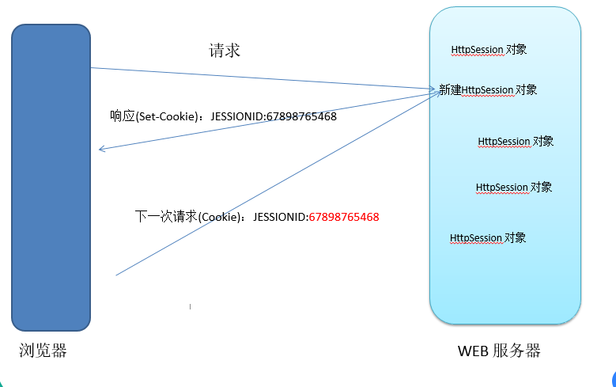
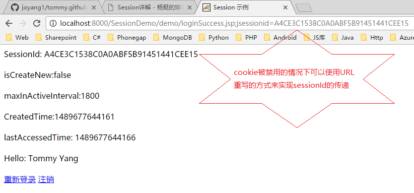
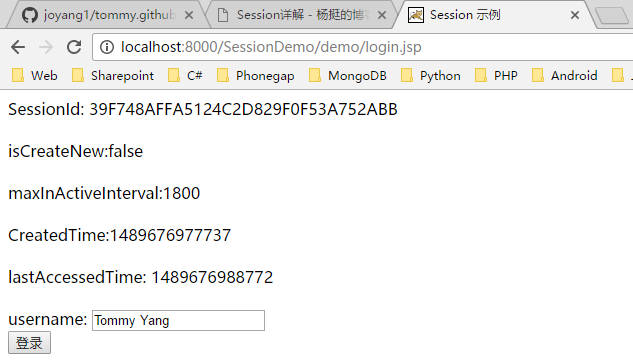
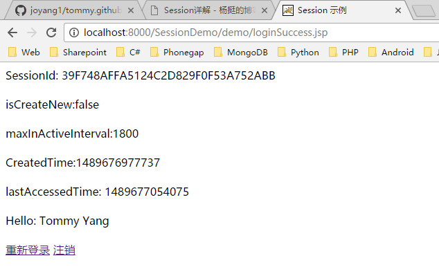
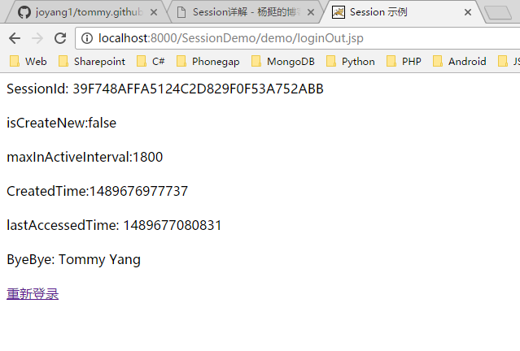

[TOC]


# session详解

/Users/jerryye/backup/studio/AvailableCode/web/jsp/session_cookie/session

## Session的由来

上一篇博文介绍了Cookie的相关知识，其中介绍了必须采用一种机制来唯一标识一个用户，同时记录该用户的状态。
于是就引入了第一种机制:Cookie机制;那么第二种就是Session机制。<br/>
Session机制：采用的是在服务器端保持Http状态信息的方案。结合两篇博文也可以看出两种机制最明显的区别就是cookie是存储子在客户端，
而Session是存储在服务器端。具体两者的区别我会在下一篇博文详细介绍。
	
## Session的定义即基本介绍

Session，有始有终的一系列动作/消息的意思，其实我们举一个小例子来说:比如我们一次打电话，从接起电话到你挂断电话的一系列过程可以称为一个Session。
Session在Web开发环境下的语义又有了新的扩展，它的含义是指一类用来在客户端与服务器端之间保持状态的解决方案。
   有时候Session也用来指这种解决方案的存储结构。

## Session存储方式
Tomcat 服务器使用 如下保存.

org.apache.catalina.session.ManagerBase#sessions

```
protected Map<String, Session> sessions = new ConcurrentHashMap();	
```

## Session标识传递的过程

当程序需要为某个客户端的请求创建一个session时，服务器首先检查这个客户端的请求里是否包含了一个session标识(即sessionId),
如果已经包含一个sessionId则说明以前已经为此客户创建过session，服务器就按照session id把这个session检索出来使用(如果检索不到，
可能会新建一个，这种情况可能出现在服务端已经删除了该用户对应的session对象，但用户人为地在请求的URL后面附加上一个JSESSION的参数)。
如果客户请求不包含sessionId，则为此客户创建一个session并且生成一个与此session相关联的sessionId，这个sessionId将在本次响应中返回给客户端保存。<br/>
下面是流程图:<br />


## Session的几种存储方式

1. 使用Cookie: 保存session id的方式可以采用cookie，这样在交互过程中浏览器可以自动的按照规则把这个标识发送给服务器，这种cookie称为session cookie。
如下图:


2. URL重写: 由于cookie可以被人为的禁用，必须有其它的机制以便在cookie被禁用时仍然能够把session id传递回服务器，
   经常采用的一种技术叫做URL重写，就是把session id附加在URL路径的后面，附加的方式也有两种，一种是作为URL路径的附加信息，
   另一种是作为查询字符串附加在URL后面。网络在整个交互过程中始终保持状态，就必须在每个客户端可能请求的路径后面都包含这个session id。
如下图:<br/>

   
## Session的创建与删除

1. Session创建
   (1). 对于Jsp: 若当前页面为浏览器（客户端）访问web应用的第一个资源页面且Jsp的Page指定的Session属性的值为true。
   (2). 对于Servlet: 若当前Servlet为浏览器（客户端）访问web应用的第一个资源时，使用request.getSession()或request.getSession(true)创建。
2. Session删除
   (1). 调用session.invalidate()方法
   (2). 卸载web应用程序
   (3). 超过了HttpSession的过期时间
   
## Session的超时管理 

WEB服务器无法判断当前的客户端浏览器是否还会继续访问，也无法检测客户端浏览器是否关闭，所以，即使客户已经离开或关闭了浏览器，
WEB服务器还要保留与之对应的HttpSession对象。<br/>
随着时间的推移而不断增加新的访问客户端，WEB服务器内存中将会因此积累起大量的不再被使用的HttpSession对象，并将最终导致服务器内存耗尽。<br/> 
WEB服务器采用“超时限制”的办法来判断客户端是否还在继续访问，如果某个客户端在一定的时间之内没有发出后续请求，WEB服务器则认为客户端已经停止了活动，
结束与该客户端的会话并将与之对应的HttpSession对象变成垃圾。<br/> 
如果客户端浏览器超时后再次发出访问请求，WEB服务器则认为这是一个新的会话的开始，将为之创建新的HttpSession对象和分配新的会话标识号。 <br/> 
会话的超时间隔可以在web.xml(Tomcat服务器或者web应用程序)文件中设置，其默认值由Servlet容器定义。 <br/> 
```sh
<session-config>
    <session-timeout>30</session-timeout>
</session-config>
```

## How to run code

1. 将代码clone到本地，使用eclipse导入代码，导入的时候项目的类型选择"git project"。
2. 右键项目 run on Server。

法二: 将项目中WebContent中的内容拷入你的Tomccat服务器下的webapps目录下你建的站点名，
      然后启动tomcat服务器,
      在浏览器中输入: http://localhost:8080/站点名，即可访问<br/>

## 站点页面展示

### login页面


### loginSuccess页面


### loginOut页面

